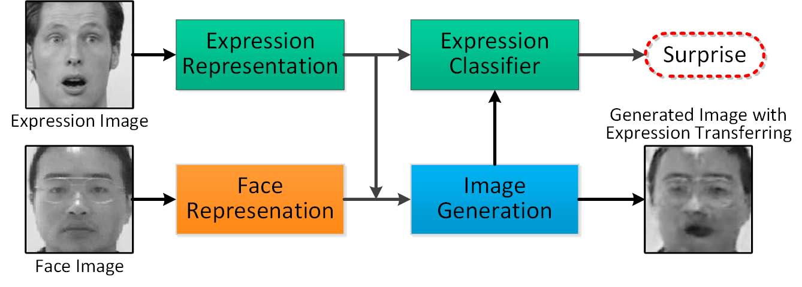
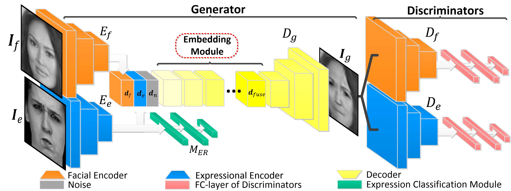

# TDGAN: Two-branch Disentangled Generative Adversarial Network

<p align="left"></p>

This is the code repository of model **TDGAN** for facial expression recognition (FER), which is an  algorithm presented in the following paper:
> Xie, Siyue, Haifeng Hu, and Yizhen Chen. "Facial Expression Recognition with Two-branch Disentangled Generative Adversarial Network." IEEE Transactions on Circuits and Systems for Video Technology (2020).

> **Abstract:** Facial Expression Recognition (FER) is a challenging task in computer vision as features extracted from expressional images are usually entangled with other facial attributes, e.g., poses or appearance variations, which are adverse to FER. To achieve a better FER performance, we propose a model named Two-branch Disentangled Generative Adversarial Network (TDGAN) for discriminative expression representation learning. Different from previous methods, TDGAN learns to disentangle expressional information from other unrelated facial attributes. To this end, we build the framework with two independent branches, which are specific for facial and expressional information processing respectively. Correspondingly, two discriminators are introduced to conduct identity and expression classification. By adversarial learning, TDGAN is able to transfer an expression to a given face. It simultaneously learns a discriminative representation that is disentangled from other facial attributes for each expression image, which is more effective for FER task. In addition, a self-supervised mechanism is proposed to improve representation learning, which enhances the power of disentangling. Quantitative and qualitative results in both in-the-lab and in-the-wild datasets demonstrate that TDGAN is competitive to the state-of-the-art methods.

The paper is available at [here](https://ieeexplore.ieee.org/abstract/document/9197663/).


## Quick Start: one evaluation step with a pretrained model
1. Download the model file from:
    - Google Drive: click [here](https://drive.google.com/file/d/10zYyQWO1hp9q1MhAmt4ioD42g-88QtBv/view?usp=sharing)
    - BaiduYun: click [here](https://pan.baidu.com/s/1Rt-KQEGWMqjb2CcCVtpjug), (auth code: uyii).
2. Extract the pretrained model and place it under the directory: `./Dataset/examples`
3. Go for a quick demo through command: ``python main.py``. This command will perform an evaluation step and generate an image under directory `./Dataset/examples`, with a file name of `generated_example.png`.

## Requirements

- Numpy
- Pytorch > 1.3
- Pillow

## Model Description

The framework of the model:

<!-- <p align="left"></p> -->

TDGAN learns image representations through expression transferring.
The inputs are two images: one facial image with identity label and one expressional image with expression label.
The goal of the generator is to transfer the expression from the expressional image to the face image.
Therefore, TDGAN includes two separate branch for extracting corresponding image representations and then using a deconv-based decoder to generate the image.
To make sure that the generated image fulfills our expectation, there are two discriminators for TDGAN to evaluate the generated image.
One is a face discriminator, which conducts identity classification (so that TDGAN can know whether the face appearance in the generated image is the same as that of the input facial image).
The other is an expression discriminator, which conducts expression classification (so that TDGAN can know whether the expression in the generated image is the same as that of the input expressional image).
Note that the expected identity information can only be extracted from the input facial image, while the expected expression information can only be extracted from the input expressional image.
Therefore, by adversarial training, the face branch will tend to extract only identity (facial appearance) related features while the expression branch will tend to extract only expression related features.
In other word, the expression branch is induced to disentangle expressional features from other features.
We can therefore take such expression-specific features for expression classification task.

## Code Descriptions

### Directory Tree
```
TDGAN   
│   LoadData.py  
│   main.py  
│   models.py    
│   README.md
│   trainer.py
│   util.py
└───Dataset
│   └───CASIA_WebFace
|   |   |   casia_data_examples.npz
│   |   └───img
│   |       └───0000045
│   |       └───0000099
│   └───examples
│   |   |   expression.jpg
│   |   |   face.jpg
│   └───RAF
|       |   RAF_examples.npz
│       └───img
```

### Directory and Files Descriptions
- `main.py` : main function of the model. Optional arguments:
    - --facedata: the specified face dataset; for this demo code, only `CASIA` is supported; you can customize your own dataset by modifying the dataloader (default: `CASIA`)
    - --exprdata: the specified expression dataset; for this demo code, only `RAF` is supported; you can customize your own dataset by modifying the dataloader (default: `RAF`)
    - --train: a flag to indicate the work mode, `True` for training and `False` evaluation (default: `False`)
    - --epoch: running epochs for training (default: `100`)
    - --batchsize: batch size for training (default: `32`)
    - --lr: learning rate for training (default: `1e-4`)
    - --gpu: specify a GPU device for running the code, `-1` for cpu setting and a positive integer for GPU setting (default: `-1`)
    - All other hyper-parameters are hard coded in the variable `hpar_dict` in the `main.py`. If you want to specify each hyper-parameter, you can manually modify the values.
- `trainer.py`: trainer for model training and evaluation
- `models.py`: all modules' implementations 
- `LoadData.py`: customized datasets class for pytorch's dataloader
- `util.py`: some other functions
- Dataset: data directory that stores all required image data and label data
    - `./Dataset/CASIA_WebFace/casia_data_examples.npz`: the file that stores the file name of all required images in the `CASIA_WebFace` dataset
    - `./Dataset/RAF/RAF_data_examples.npz`: the file that stores the file name of all required images in the `RAF` dataset

## Datasets

Experiments are conducted on three in-the-lab datasets (CK+, TFEID, RaFD) and two in-the-wild datasets (BAUM-2i, RAF-DB).

All the datasets are publicly accessible in the following links:
- **CK+**: [application form](http://www.jeffcohn.net/wp-content/uploads/2020/10/2020.10.26_CK-AgreementForm.pdf100.pdf.pdf)
    - The Extended Cohn-Kanade (CK+) [22] contains 593 image sequences collected from 123 subjects. 433 Expressions in each sequence vary from neutral face to the 434 peak expression. In this dataset, only sequences are labelled with one of the six prototypical expressions (anger, disgust, fear, happiness, sadness, surprise) and thus selected out for experiments. We pick out the last three frames of each sequence to construct the training and testing sets. Additionally, the first frame of each selected sequence is collected as a neural face. Therefore, there are totally 1236 images involved in our experiments.
- **TFEID**: download [link](http://bml.ym.edu.tw/tfeid/) (but currently their server seems crashed...)
    - Taiwanese Facial Expression Image Database (TFEID) is captured from 40 models, each with eight facial expressions(six typical expression + neural + contempt). In our experiments, we only pick out the images that are labeled with six basic expression and the neutral. Therefore, 580 images of TFEID are involved in our experiments.
- **RaFD**: download [link](http://www.socsci.ru.nl:8180/RaFD2/RaFD)
    - The Radboud Faces Database (RaFD) is a set of pictures collected from 67 model with different ethnics. Each picture of the dataset is annotated with an expression as well as the corresponding identity. To compare with other state-of-the-art methods, we only collect the images labeled with one of the seven expressions (six prototypical expressions+neutral). Therefore, there are totally 1407 images used in our experiments.
- **BAUM-2i**: download [link](http://baum2.bahcesehir.edu.tr/)
    - BAUM-2i is a static expression dataset, which is sorted out from BAUM-2, a dataset of audio-visual affective facial clips collected from movies and TV series. BAUM-2i contains samples under diverse conditions reflecting the eight expressions (six typical expressions plus the neutral and contemp). In our experiments, 998 images labeled with one of the seven expressions (contempt excluded) are used to evaluate our model.
- **RAF-DB**: download [link](http://www.whdeng.cn/raf/model1.html)
    - Real-world Affective Faces Database (RAF-DB) is a large-scale facial expression database that all images are collected from the Internet and annotated by human. In our experiments, we only use the single-label subset (including six typical expressions and the neutral) to evaluate the TDGAN. The predefined training set includes 12271 samples and the size of the test set is 3068.

## Preprocessing and Setup

In the preprocessing stage, faces in the input images (including both face and expression images) are first detected by the [MTCNN](https://github.com/ipazc/mtcnn) and then resized to 128x128x1.
Data augmentation (random cropping and horizontal flipping) is also adopted in the training stage.
To fairly compared with other methods, in CK+, TFEID, RaFD and BAUM-2i, we conduct subject-independent 10-fold cross-validation to evaluate our model.
In RAF-DB, TDGAN is trained and evaluated in the predefined training and testing sets.


## Results on Expression Classification Task (main task) 

Details will be added soon.

## Visualization Results

Details will be added soon.